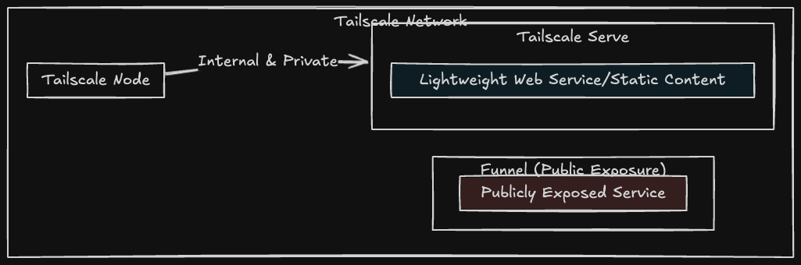

# Tailscale Docker Sidecar Configuration Examples

This repository provides examples of using [Tailscale](https://tailscale.com/) in a sidecar configuration within Docker, specifically for integrating Tailscale with services like [AdGuard Home](https://github.com/AdguardTeam/AdGuardHome), [Plex Media Server](https://www.plex.tv/) and [Beszel](https://github.com/henrygd/beszel). By leveraging Tailscale's secure networking capabilities, these examples demonstrate how to seamlessly route traffic through Tailscale while maintaining service functionality and security.

The provided configurations showcase how to set up Tailscale alongside Docker services, with a focus on ensuring connectivity, security, and ease of deployment. The examples include configurations for Tailscale authentication, state management, and service routing.

The example below illustrates a basic setup where Tailscale is used to manage network traffic for AdGuard Home in a Docker environment, utilizing a sidecar approach to simplify networking and enhance security.

If you would like to add your own config, you can use the [service-template](templates/service-template/).

## Currently Available Example Configurations

- [AdGuard Home](services/adguardhome)
- [Bazarr](services/bazarr)
- [Beszel](services/beszel)
- [Excalidraw](services/excalidraw)
- [Gokapi](services/gokapi)
- [LanguageTool](services/languagetool)
- [NextCloud](services/nextcloud)
- [Pi-hole](services/pihole)
- [Plex](services/plex)
- [Portainer](services/portainer)
- [Radarr](services/radarr)
- [Resilio Sync](services/resilio-sync)
- [searXNG](services/searxng)
- [Sonarr](services/sonarr)
- [Stirling-PDF](services/stirlingpdf)
- [Tailscale Exit Node](services/tailscale-exit-node)
- [Tautulli](services/tautulli)
- [Technitium DNS](services/technitium)
- [Uptime Kuma](services/uptime-kuma)
- [Vaultwarden](services/vaultwarden)
- [qBittorrent](services/qbittorrent)

## Tailscale Funnel vs. Tailscale Serve

Tailscale Funnel securely exposes services to the public internet. Tailscale Serve is for sharing content within a private Tailscale network (Tailnet). You'll need to decide how you want to expose the service, the configurations in this repository exposes the local Tailnet.

### Tailscale Funnel

[Tailscale Funnel](https://tailscale.com/kb/1223/funnel) is a feature that lets you route traffic from the wider internet to a local service running on a machine in your Tailscale network (known as a tailnet). You can think of this as publicly sharing a local service, like a web app, for anyone to access—even if they don’t have Tailscale themselves.

An example configuration for Tailscale Funnel for your service is available [here](funnel-serve/funnel-example.json).

### Tailscale Serve

[Tailscale Serve](https://tailscale.com/kb/1312/serve) is a feature that lets you route traffic from other devices on your Tailscale network (known as a tailnet) to a local service running on your device. You can think of this as sharing the service, such as a website, with the rest of your tailnet.

An example configuration for Tailscale Serve for your service is available [here](funnel-serve/serve-example.json).

## Tailscale Documentation

- [Tailscale.com - Knowledge Base](https://tailscale.com/kb)
- [Tailscale.com - Funnel](https://tailscale.com/kb/1223/funnel)
- [Tailscale.com - Serve](https://tailscale.com/kb/1242/tailscale-serve)
- [Tailscale.com - Docker Tailscale Guide](https://tailscale.com/blog/docker-tailscale-guide)

## License

[MIT](https://choosealicense.com/licenses/mit/)
