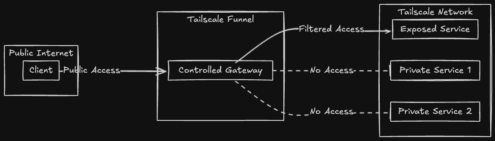
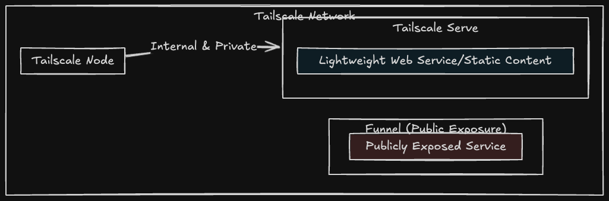

# ScaleTail - Secure Self-Hosting Made Simple

[](https://github.com/tailscale-dev/ScaleTail/stargazers)
[](LICENSE)
[](https://www.docker.com/)
[](https://tailscale.com/)

ScaleTail provides ready-to-run [Docker Compose](https://docs.docker.com/compose) stacks that instantly connect your self-hosted applications to your [Tailnet](https://tailscale.com/docs/concepts/tailnet). By using a Docker sidecar configuration, your applications get an [URL](https://grokipedia.com/page/URL) with automatic [HTTPS](https://grokipedia.com/page/HTTPS), for example: `https://application.tail-net.ts.net`.

## Featured by Tailscale

[Alex](https://github.com/ironicbadger) from the official Tailscale YouTube channel did a deep dive into ScaleTail! He walks through how to deploy a secure, private service of ScaleTail in under 10 minutes.

[](https://www.youtube.com/watch?v=ZoEZ7oHA7Gg)

## Quick Start

**Requirement:** *Docker Compose and [Git](https://git-scm.com/) must be installed. Preferably on a Linux operating system.*

1. **Get an Auth Key**  

   Go to the [Tailscale Admin Console → Keys](https://login.tailscale.com/admin/settings/keys) and generate a new auth key.

2. **Clone and Choose a Service**

   Clone the repository and change directory to your desired service with the following command:

   ``` bash
   git clone https://github.com/tailscale-dev/ScaleTail.git
   cd ScaleTail/services/YourDesiredService 
   ```

3. **Configure and Launch**

   - Open the `.env` file in your chosen service directory.
   - Add your auth key after the line `TS_AUTHKEY=`.
   - Start the Docker compose stack:

   ``` bash
   docker compose up -d
   ```

## Table of Contents

- [ScaleTail - Secure Self-Hosting Made Simple](#scaletail---secure-self-hosting-made-simple)
  - [Featured by Tailscale](#featured-by-tailscale)
  - [Quick Start](#quick-start)
  - [Table of Contents](#table-of-contents)
  - [Available Configurations](#available-configurations)
    - [🌐 Networking and Security](#-networking-and-security)
    - [🎥 Media and Entertainment](#-media-and-entertainment)
    - [💼 Productivity and Collaboration](#-productivity-and-collaboration)
    - [📊 Dashboards and Visualization](#-dashboards-and-visualization)
    - [🛠️ Development Tools](#️-development-tools)
    - [📈 Monitoring and Analytics](#-monitoring-and-analytics)
    - [🏠 Smart Home](#-smart-home)
    - [📱 Utilities](#-utilities)
    - [🍽️ Food \& Wellness](#️-food--wellness)
  - [Tailscale Information](#tailscale-information)
    - [Tailscale Funnel vs. Tailscale Serve](#tailscale-funnel-vs-tailscale-serve)
    - [Tailscale Funnel](#tailscale-funnel)
    - [Tailscale Serve](#tailscale-serve)
  - [Tailscale Documentation](#tailscale-documentation)
  - [Contributors](#contributors)
  - [Contributing](#contributing)
  - [Star History](#star-history)
  - [License](#license)

## Available Configurations

### 🌐 Networking and Security

| 🌐 Service                          | 📝 Description                                                                        | 🔗 Link                                           |
| ---------------------------------- | ------------------------------------------------------------------------------------ | ------------------------------------------------ |
| 🛡️ **AdGuard Home**                 | Network-wide software for blocking ads and tracking.                                 | [Details](services/adguardhome)                  |
| 🔄 **AdGuardHome Sync**             | A tool for syncing configuration across multiple AdGuard Home instances.             | [Details](services/adguardhome-sync)             |
| 🌐 **Caddy**                        | Caddy is an extensible server platform that uses TLS by default.                     | [Details](services/caddy)                        |
| 🌐 **DDNS Updater**                 | A self-hosted solution to keep DNS A/AAAA records updated automatically.             | [Details](services/ddns-updater)                 |
| 🌐 **Flaresolverr**                 | A proxy server to bypass Cloudflare and DDoS-GUARD protection.                       | [Details](services/flaresolverr)                 |
| 🔍 **Nessus**                       | A powerful vulnerability scanner with a free Essentials model for home use.          | [Details](services/nessus)                       |
| 🗃️ **Netbox**                       | NetBox is the leading solution for modeling and documenting modern networks.         | [Details](services/netbox)                       |
| 🧩 **Pi-hole**                      | A network-level ad blocker that acts as a DNS sinkhole.                              | [Details](services/pihole)                       |
| 🆔 **Pocket ID**                    | A self-hosted decentralized identity (OIDC) solution for secure authentication.      | [Details](services/pocket-id)                    |
| 🌐 **Rustdesk Server**              | RustDesk is an open source remote control alternative for self-hosting and security. | [Details](services/rustdesk-server)              |
| 🔒 **Technitium DNS**               | An open-source DNS server that can be used for self-hosted DNS services.             | [Details](services/technitium)                   |
| 🌐 **Traefik**                      | A modern reverse proxy and load balancer for microservices.                          | [Details](services/traefik)                      |
| 🌐 **Tailscale App Connector Node** | Configure a device to act as a App connector node for your Tailscale network.        | [Details](services/tailscale-app-connector-node) |
| 🚀 **Tailscale Exit Node**          | Configure a device to act as an exit node for your Tailscale network.                | [Details](services/tailscale-exit-node)          |
| 🌐 **Tailscale Subnet Router Node** | Configure a device to act as a subnet router node for your Tailscale network.        | [Details](services/tailscale-subnet-router-node) |

### 🎥 Media and Entertainment

| 🎥 Service            | 📝 Description                                                                                           | 🔗 Link                             |
| -------------------- | ------------------------------------------------------------------------------------------------------- | ---------------------------------- |
| 🎵 **ArtistTrackarr** | A self-hosted dashboard for tracking upcoming and newly released albums and EPs.                        | [Details](services/artisttrackarr) |
| 🎧 **Audiobookshelf** | A self-hosted audiobook and podcast server with multi-user support and playback syncing.                | [Details](services/audiobookshelf) |
| 🎥 **Bazarr**         | A companion tool to Radarr and Sonarr for managing subtitles.                                           | [Details](services/bazarr)         |
| 📚 **BookLore**       | A self-hosted application for managing and reading books.                                               | [Details](services/booklore)       |
| 📰 **FreshRSS**       | A customizable feed reader with themes, extensions, and no separate database.                           | [Details](services/freshrss)       |
| 🎥 **Frigate**        | A self-hosted NVR with real-time AI object detection for IP cameras and local video monitoring.         | [Details](services/frigate)        |
| 🎮 **Hytale**         | A self-hosted Hytale game server.                                                                       | [Details](services/hytale)         |
| 🖼️ **Immich**         | A self-hosted Google Photos alternative with face recognition and mobile sync.                          | [Details](services/immich)         |
| 📺 **Jellyfin**       | An open-source media system that puts you in control of managing and streaming your media.              | [Details](services/jellyfin)       |
| 📖 **Kavita**         | An open-source, self-hosted digital library for comics, manga, and ebooks.                              | [Details](services/kavita)         |
| 📻 **Miniflux**       | A minimalist and opinionated feed reader.                                                               | [Details](services/miniflux)       |
| 🎶 **Navidrome**      | Your Personal Streaming Service self-hosted.                                                            | [Details](services/navidrome)      |
| 🎶 **Swing Music**    | A fast, beautiful, self-hosted music streaming server for your local audio library.                     | [Details](services/swingmx)        |
| 🎬 **Seerr**          | A request management and media discovery tool for Plex, Jellyfin and Emby.                              | [Details](services/seerr)          |
| 📚 **Paperless-ngx**  | An open-source document management system that transforms physical documents into a searchable archive. | [Details](services/paperless)      |
| 🎵 **Picard**         | MusicBrainz Picard is a cross-platform music tagger for organizing and tagging music files.             | [Details](services/picard)         |
| 🎬 **Plex**           | A media server that organizes video, music, and photos from personal media libraries.                   | [Details](services/plex)           |
| 📥 **qBittorrent**    | An open-source BitTorrent client.                                                                       | [Details](services/qbittorrent)    |
| 📡 **Prowlarr**       | An indexer manager and proxy for applications like Radarr, Sonarr, and Lidarr.                          | [Details](services/prowlarr)       |
| 🎞️ **Radarr**         | A movie collection manager for Usenet and BitTorrent users.                                             | [Details](services/radarr)         |
| 📡 **Sonarr**         | A PVR for Usenet and BitTorrent users to manage TV series.                                              | [Details](services/sonarr)         |
| 🔗 **Slink**          | A fast, self-hosted alternative to ShareDrop for secure local file sharing.                             | [Details](services/slink)          |
| 📊 **Tautulli**       | A monitoring and tracking tool for Plex Media Server.                                                   | [Details](services/tautulli)       |
| 📺 **Metube**         | A self-hosted YouTube downloader with playlist support.                                                 | [Details](services/metube)         |
| ⚙️ **Configarr**      | Manage and sync configuration for Radarr, Sonarr, and related services.                                 | [Details](services/configarr)      |
| 🖼️ **Posterizarr**    | Automatically generates and updates posters/artwork for media libraries.                                | [Details](services/posterizarr)    |
| ♻️ **Recyclarr**      | Tools for managing, migrating, and maintaining indexers and quality profiles.                           | [Details](services/recyclarr)      |

### 💼 Productivity and Collaboration

| 💼 Service           | 📝 Description                                                                                                                                                              | 🔗 Link                            |
| ------------------- | -------------------------------------------------------------------------------------------------------------------------------------------------------------------------- | --------------------------------- |
| 💰 **Actual Budget** | A self-hosted personal finance and budgeting app focused on privacy and full data ownership.                                                                               | [Details](services/actual-budget) |
| ⚓ **Anchor**        | An offline-first, self-hosted note-taking app with sync, attachments, sharing, and optional OIDC authentication.                                                           | [Details](services/anchor)        |
| 📄 **BentoPDF**      | A lightweight, self-hosted web app for viewing and managing PDF documents.                                                                                                 | [Details](services/bentopdf)      |
| ✂️ **ClipCascade**   | A self-hosted clipboard manager for syncing and organizing clipboard history.                                                                                              | [Details](services/clipcascade)   |
| 🗂️ **Copyparty**     | A self-hosted file server with accelerated resumable uploads.                                                                                                              | [Details](services/copyparty)     |
| ✅ **Donetick**      | A self-hosted task and checklist manager for productivity.                                                                                                                 | [Details](services/donetick)      |
| 📚 **Docmost**       | A self-hosted, real-time collaborative wiki with rich editing, diagrams, permissions, and full-text search.                                                                | [Details](services/docmost)       |
| ✅ **DumbDo**        | A self-hosted, minimalistic task manager for simple to-do lists.                                                                                                           | [Details](services/dumbdo)        |
| ✅ **Eigenfocus**    | A self-hosted task and project management tool for productivity.                                                                                                           | [Details](services/eigenfocus)    |
| 🗂️ **EspoCRM**       | A CRM for Sales, support and marketing.                                                                                                                                    | [Details](services/espocrm)       |
| 📝 **Excalidraw**    | A virtual collaborative whiteboard tool.                                                                                                                                   | [Details](services/excalidraw)    |
| 📝 **Flatnotes**     | A simple, self-hosted note-taking app using Markdown files.                                                                                                                | [Details](services/flatnotes)     |
| 👨🏼‍💻 **Forgejo**       | A community-driven, self-hosted Git service.                                                                                                                               | [Details](services/forgejo)       |
| 📋 **Formbricks**    | A self-hosted, open-source platform for collecting user feedback, surveys, and NPS.                                                                                        | [Details](services/formbricks)    |
| 👨🏼‍💻 **Gitea**         | A lightweight, self-hosted Git service with repository hosting, pull requests, and issue tracking.                                                                         | [Details](services/gitea)         |
| ✍️ **Ghost**         | A modern, open-source publishing platform for blogs and newsletters.                                                                                                       | [Details](services/ghost)         |
| 🧑‍🧑‍🧒‍🧒 **Gramps Web** | A web-based genealogy platform for collaborative family tree browsing, editing, AI-powered chat, media tagging, mapping, charts, search, and reporting.                    | [Details](services/grampsweb)     |
| 🔖 **Haptic**        | Haptic is a new local-first & privacy-focused, open-source home for your markdown notes.                                                                                   | [Details](services/haptic)        |
| 🌿 **Isley**         | A self-hosted cannabis grow journal for tracking plants and managing grow data.                                                                                            | [Details](services/isley)         |
| 🗒️ **Karakeep**      | A self-hosted, collaborative note-taking app — a private alternative to Google Keep.                                                                                       | [Details](services/karakeep)      |
| 🗂️ **Kaneo**         | A modern, self-hosted project management platform focused on simplicity.                                                                                                   | [Details](services/kaneo)         |
| 🧠 **LanguageTool**  | An open-source proofreading software for multiple languages.                                                                                                               | [Details](services/languagetool)  |
| 🔖 **Linkding**      | A self-hosted bookmark manager to save and organize links.                                                                                                                 | [Details](services/linkding)      |
| 📥 **Mattermost**    | A self-hosted collaborative workflow and communication tool.                                                                                                               | [Details](services/mattermost)    |
| 📝 **Memos**         | A lightweight, self-hosted note-taking and knowledge management platform for capturing ideas, daily notes, and personal knowledge.                                         | [Details](services/memos)         |
| 📝 **Nanote**        | A lightweight, self-hosted note-taking app with Markdown support.                                                                                                          | [Details](services/nanote)        |
| 🤖 **Open WebUI**    | A self-hosted AI platform with a ChatGPT-style interface for local and cloud-based models.                                                                                 | [Details](services/open-webui)    |
| 🔗 **Pingvin Share** | **PROJECT ARCHIVED** A self-hosted file sharing platform.                                                                                                                  | [Details](services/pingvin-share) |
| 📅 **Radicale**      | A lightweight CalDAV and CardDAV server for self-hosted calendar, to-do, and contact sync.                                                                                 | [Details](services/radicale)      |
| 🔄 **Resilio Sync**  | A fast, reliable, and simple file sync and share solution.                                                                                                                 | [Details](services/resilio-sync)  |
| 📁 **Seafile**       | A self-hosted file syncing and collaboration platform with file sharing, versioning, and team library support.                                                             | [Details](services/seafile)       |
| 🗂️ **Stirling-PDF**  | A web application for managing and editing PDF files.                                                                                                                      | [Details](services/stirlingpdf)   |
| 💰 **Sure Finance**  | A self-hosted personal finance and budgeting app with optional AI insights.                                                                                                | [Details](services/sure)          |
| 🏦 **Subtrackr**     | A self-hosted web app to track subscriptions, renewal dates, costs, and payment methods.                                                                                   | [Details](services/subtrackr)     |
| 🗃️ **Vaultwarden**   | An unofficial Bitwarden server implementation written in Rust.                                                                                                             | [Details](services/vaultwarden)   |
| ✅ **Vikunja**       | A self-hosted task and project management platform with projects, reminders, labels, recurring tasks, and collaboration features.                                          | [Details](services/vikunja)       |
| 💸 **Wallos**        | An open-source, self-hostable web app to track and manage your recurring subscriptions and expenses, with multi-currency support, customizable categories, and statistics. | [Details](services/wallos)        |
| 📚 **XWiki**         | XWiki offers a generic platform for developing projects and collaborative applications using the wiki paradigm.                                                            | [Details](services/xwiki)         |

### 📊 Dashboards and Visualization

| 📊 Service                | 📝 Description                                                                                                       | 🔗 Link                                 |
| ------------------------ | ------------------------------------------------------------------------------------------------------------------- | -------------------------------------- |
| 🧭 **Glance**             | A concise, customizable dashboard for self-hosted services and personal metrics.                                    | [Details](services/glance)             |
| 🏠 **Homepage**           | A modern, highly customizable homepage for organizing links and monitoring services.                                | [Details](services/homepage)           |
| 🖼️ **NewWallpaperWhoDis** | A lightweight, self-hosted wallpaper management server and dynamic rotation engine built on flat-file architecture. | [Details](services/newwallpaperwhodis) |


### 🛠️ Development Tools

| 🛠️ Service                | 📝 Description                                                                                               | 🔗 Link                              |
| ------------------------ | ----------------------------------------------------------------------------------------------------------- | ----------------------------------- |
| 🧰 **Arcane**             | A self-hosted Docker management UI for Compose stacks; this repo includes a Tailscale sidecar example.      | [Details](services/arcane)          |
| 🖥️ **Changedetection.io** | A tool for monitoring website changes.                                                                      | [Details](services/changedetection) |
| 🛠️ **Coder**              | Self-hosted cloud dev environments with browser IDEs, Terraform-managed workspaces.                         | [Details](services/coder)           |
| 🔧 **Cyberchef**          | A web app for encryption, encoding, compression, and data analysis.                                         | [Details](services/cyberchef)       |
| 🐳 **Dockhand**           | A modern, lightweight Docker management UI for containers and Compose stacks.                               | [Details](services/dockhand)        |
| 🐳 **Dockge**             | A lightweight, self-hosted Docker Compose stack manager with a web UI.                                      | [Details](services/dockge)          |
| 🖥️ **Dozzle**             | A real-time log viewer for Docker containers.                                                               | [Details](services/dozzle)          |
| 🔁 **FossFLOW**           | A self-hosted tool to make beautiful isometric infrastructure diagrams.                                     | [Details](services/fossflow)        |
| 🖥️ **GitSave**            | A self-hosted service to back up your GitHub repositories via a simple REST API and scheduled runs.         | [Details](services/gitsave)         |
| 🖥️ **Gokapi**             | A lightweight self-hosted file sharing platform.                                                            | [Details](services/gokapi)          |
| 🖥️ **Homarr**             | A sleek dashboard for all your Homelab services.                                                            | [Details](services/homarr)          |
| 🖥️ **IT-Tools**           | A collection of handy online tools for developers and sysadmins.                                            | [Details](services/it-tools)        |
| 📧 **Mailpit**            | A self-hosted email testing tool for capturing, viewing, and debugging outgoing emails during development.  | [Details](services/mailpit)         |
| 🖥️ **Node-RED**           | A flow-based development tool for visual programming.                                                       | [Details](services/nodered)         |
| 🖥️ **Portainer**          | A lightweight management UI which allows you to easily manage your Docker environments.                     | [Details](services/portainer)       |
| 🔍 **searXNG**            | A free internet metasearch engine which aggregates results from various search services.                    | [Details](services/searxng)         |
| 🧠 **Ollama**             | A self-hosted solution for running open large language models (LLMs) locally with an OpenAI-compatible API. | [Details](services/ollama)          |

### 📈 Monitoring and Analytics

| 📈 Service               | 📝 Description                                                                            | 🔗 Link                                |
| ----------------------- | ---------------------------------------------------------------------------------------- | ------------------------------------- |
| 📉 **Beszel Hub**        | The Beszel Hub provides historical monitoring data, Docker stats, and alerts.            | [Details](services/beszel-hub)        |
| 🛰️ **Beszel Agent**      | The Beszel Agent collects stats and reports them back to the Hub.                        | [Details](services/beszel-agent)      |
| 🔎 **Portracker**        | A simple, self-hosted port monitoring and tracking tool for auditing open ports.         | [Details](services/portracker)        |
| 🚀 **Speedtest Tracker** | A self-hosted tool to monitor and log internet speed tests with detailed visualizations. | [Details](services/speedtest-tracker) |
| 📊 **Uptime Kuma**       | A self-hosted monitoring tool like "Uptime Robot".                                       | [Details](services/uptime-kuma)       |

### 🏠 Smart Home

| 🏠 Service            | 📝 Description                                                          | 🔗 Link                             |
| -------------------- | ---------------------------------------------------------------------- | ---------------------------------- |
| 🏡 **Home Assistant** | An open-source home automation platform for controlling smart devices. | [Details](services/home-assistant) |
|  **Home Bridge** | Homebridge is a lightweight Node.js server that emulates the HomeKit API. | [Details](services/homebridge) |

### 📱 Utilities

| 📱 Service        | 📝 Description                                                                                                     | 🔗 Link                          |
| ---------------- | ----------------------------------------------------------------------------------------------------------------- | ------------------------------- |
| 🔁 **ConvertX**   | A fast, full-featured self-hosted conversion API for images, docs, videos, and more.                              | [Details](services/convertx)    |
| 🔔 **Gotify**     | A simple server for sending and receiving messages in real-time.                                                  | [Details](services/gotify)      |
| 🔐 **Hemmelig**   | A self-hosted, zero-knowledge encrypted secret sharing platform with expiring secrets.                            | [Details](services/hemmelig)    |
| 📦 **Homebox**    | A self-hosted home inventory and asset management system.                                                         | [Details](services/homebox)     |
| 🚗 **LubeLogger** | Self-hosted vehicle maintenance tracker with private access.                                                      | [Details](services/lube-logger) |
| 📱 **Mini-QR**    | A minimal, self-hosted QR code generator with a mobile-friendly UI.                                               | [Details](services/miniqr)      |
| 📣 **ntfy**       | A simple HTTP-based pub/sub notification service for sending push notifications.                                  | [Details](services/ntfy)        |
| 🚗 **Tracktor**   | Self-hosted vehicle maintenance tracker.                                                                          | [Details](services/tracktor)    |
| 🔁 **Transmute**  | A self-hosted file conversion and transformation service for handling documents, media, and other format changes. | [Details](services/transmute)   |

### 🍽️ Food & Wellness

| 🥘 Service             | 📝 Description                                                                                                                                              | 🔗 Link                         |
| --------------------- | ---------------------------------------------------------------------------------------------------------------------------------------------------------- | ------------------------------ |
| 🥘 **Kitchenowl**      | A self-hosted smart grocery list and recipe manager with features like expense tracking, weekly meal planner, rich recipe import options and OIDC support. | [Details](services/kitchenowl) |
| 🥘 **Mealie**          | A self-hosted recipe manager and meal planner with features like shopping lists, scaling, and importing.                                                   | [Details](services/mealie)     |
| 🥘 **Tandoor Recipes** | A self-hosted recipe manager that also serves as a meal planner that has features such as nutrient tracking, shopping lists, importing and AI.             | [Details](services/tandoor)    |

## Tailscale Information

### Tailscale Funnel vs. Tailscale Serve

Tailscale Funnel securely exposes services to the public internet. Tailscale Serve is for sharing content within a private Tailscale network (Tailnet). You'll need to decide how you want to expose the service, the configurations in this repository exposes the local Tailnet.

### Tailscale Funnel

[Tailscale Funnel](https://tailscale.com/kb/1223/funnel) is a feature that lets you route traffic from the internet to a local service running on a machine in your Tailscale network (known as a Tailnet). You can think of this as publicly sharing a local service, like a web app, for anyone to access—even if they don’t have Tailscale themselves.



### Tailscale Serve

[Tailscale Serve](https://tailscale.com/kb/1312/serve) is a feature that lets you route traffic from other devices on your Tailscale network (known as a Tailnet) to a local service running on your device. You can think of this as sharing the service, such as a website, with the rest of your Tailnet.



## Tailscale Documentation

- [Tailscale.com - Knowledge Base](https://tailscale.com/kb)
- [Tailscale.com - Funnel](https://tailscale.com/kb/1223/funnel)
- [Tailscale.com - Serve](https://tailscale.com/kb/1242/tailscale-serve)
- [Tailscale.com - Docker Tailscale Guide](https://tailscale.com/blog/docker-tailscale-guide)
- [Tailscale - for ARM / OpenPli Setupbox](documentation/tailscale-on-arm.md)

## Contributors

A huge thank you to all our contributors! ScaleTail wouldn’t be what it is today without your time, effort, and ideas!

<!-- readme: contributors -start -->
<a href="https://github.com/tailscale-dev/ScaleTail/graphs/contributors">
  
</a>

Made with [contrib.rocks](https://contrib.rocks).
<!-- readme: contributors -end -->

## Contributing

See [CONTRIBUTING.md](/CONTRIBUTING.md) for guidance on adding services with the [template](/templates/service-template/) to keep Tailscale-sidecar setups consistent.

## Star History

[](https://star-history.dera.page/#tailscale-dev/scaletail&Date)

## License

[MIT](https://choosealicense.com/licenses/mit/)
